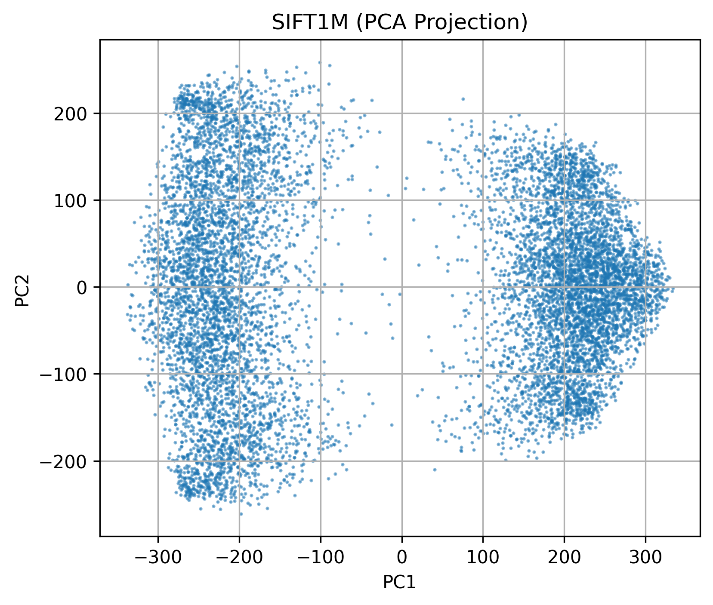

# Visualizing SIFT Descriptors with t-SNE, PCA, and HDBSCAN

This project visualizes high-dimensional SIFT descriptors using dimensionality reduction techniques such as **t-SNE**, **PCA**, and **UMAP**, combined with clustering methods like **KMeans** and **HDBSCAN**. The objective is to uncover structural patterns in the data and better understand the distribution of local image features when projected into a lower-dimensional space.

## Dataset

* **File:** `siftsmall_base.fvecs`
* **Format:** Custom binary `.fvecs` format
* **Content:** Each vector is preceded by an int32 indicating its dimensionality (typically 128 for SIFT)

## Requirements

Install the required Python libraries using pip:

```bash
pip install numpy matplotlib scikit-learn
```

## How It Works

### Step 1: Load SIFT Vectors

```python
def read_fvecs(file_path):
    with open(file_path, 'rb') as f:
        data = np.fromfile(f, dtype=np.int32)
        if data.size == 0:
            return np.array([], dtype=np.float32).reshape(0, 0)
        dim = data[0]
    data = np.fromfile(file_path, dtype=np.float32)
    return data.reshape(-1, dim + 1)[:, 1:]
```

### Step 2: t-SNE Visualization

```python
from sklearn.manifold import TSNE
sift_2d_tsne = TSNE(n_components=2, perplexity=30, init='pca', random_state=42).fit_transform(sift_vectors)
```

### Step 3: PCA Visualization (Alternative)

```python
from sklearn.decomposition import PCA
sift_2d = PCA(n_components=2).fit_transform(sift_vectors)
```

### Step 4: Plotting

```python
plt.scatter(sift_2d_tsne[:, 0], sift_2d_tsne[:, 1], s=1, alpha=0.5)
plt.title("SIFT1M (t-SNE Projection)")
```

To visualize PCA results, just replace `sift_2d_tsne` with `sift_2d` in the plotting code.

## Output

The script generates 2D scatter plots of the descriptors using either t-SNE or PCA. t-SNE typically highlights local clusters more clearly, while PCA captures directions of maximum variance.

## t-SNE Visualization


## PCA Visualization



---

## PCA + KMeans Clustering

To investigate the latent structure in SIFT descriptors, we applied **KMeans clustering** in the original 128D feature space, then projected the data to 2D using **PCA** for visualization.

KMeans provides a simple yet effective way to partition data into a predefined number of clusters, making it a useful starting point for understanding groupings.

### Motivation for PCA + KMeans

* Clustering in high-dimensional space retains the integrity of the feature relationships.
* PCA provides a fast and interpretable 2D projection for visualization.

### Observations

* KMeans identified multiple compact clusters, but some degree of overlap was observed in PCA space.
* These overlaps suggest PCA’s limitations in separating non-linear structures.
* The results helped motivate the use of density-based clustering techniques such as HDBSCAN.


---

## Clustering with HDBSCAN

To gain deeper insight, we used **HDBSCAN**, a hierarchical density-based clustering algorithm. Clustering was conducted in the original 128D feature space and then visualized using **PCA** and **UMAP**.

### Why HDBSCAN?

Unlike KMeans, HDBSCAN:

* Does not require specifying the number of clusters
* Can identify clusters of varying density and shape
* Naturally handles noise and outliers by assigning them a label of `-1`

This makes HDBSCAN a robust option for discovering intrinsic structures in feature-rich datasets.

### PCA + HDBSCAN


Visualizing the HDBSCAN output using PCA revealed two prominent clusters, though with some overlapping due to PCA’s linear projection. Noise points were effectively marked in red.

---

### UMAP + HDBSCAN


Using **UMAP** for projection led to significantly better visual separation of clusters. The two main groups were cleanly split along the UMAP-1 axis, and noise points were pushed to the periphery. This demonstrates UMAP’s ability to better preserve local neighborhood structures and enhance interpretability.

---

### Interpretation

* The emergence of two dominant clusters likely corresponds to recurring structural patterns in local image patches.
* Noise points may represent less common or ambiguous descriptors.
* UMAP + HDBSCAN proved to be the most informative combination, revealing compact, well-separated clusters and facilitating meaningful interpretation.

## License

This project is released under the MIT License.

## Related Notebooks

Explore the interactive workflows used to generate and interpret the visualizations:

* [SIFT Visualization: (TSNE & PCA)](../experiments/notebooks/visualize_sift_tsne_pca.ipynb)
* [SIFT Visualization: (KMeans + PCA)](../experiments/notebooks/visualize_sift_knn_pca_clustering.ipynb)
* [SIFT Visualization: Clustering with HDBSCAN + PCA](../experiments/notebooks/hdbscan_pca_clustering.ipynb)
* [SIFT Visualization: Clustering with HDBSCAN + UMAP](../experiments/notebooks/hdbscan_umap_clustering.ipynb)

## Author

Abhinav Gupta

---

*Note: To save visualizations or include CLI functionality, you can extend the existing scripts as needed.*
