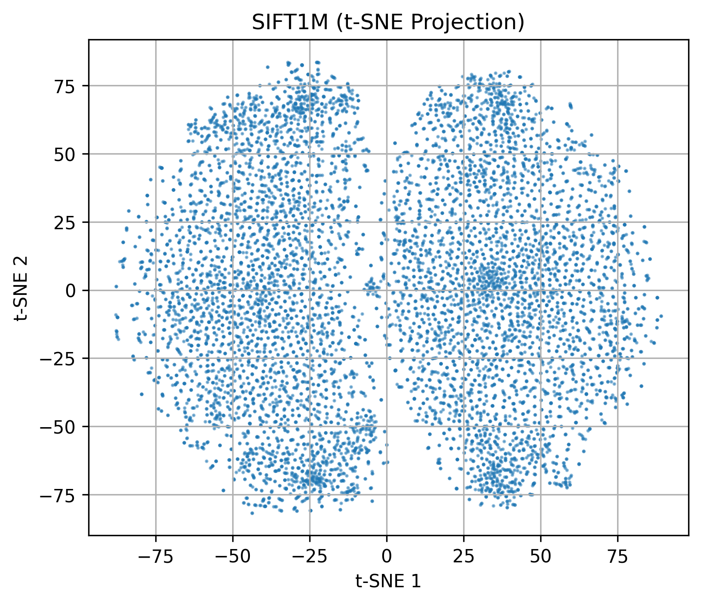

# Visualizing SIFT Descriptors with t-SNE and PCA

This project visualizes high-dimensional SIFT descriptors using two dimensionality reduction techniques: **t-SNE** and **PCA**. It helps compare the structure of the dataset when projected onto 2D space.

## Dataset

* **File:** `siftsmall_base.fvecs`
* **Format:** Custom binary `.fvecs` format
* **Content:** Each vector is preceded by an int32 indicating its dimensionality (typically 128 for SIFT)

## Requirements

Install the required Python libraries using pip:

```bash
pip install numpy matplotlib scikit-learn
```

## How It Works

### Step 1: Load SIFT Vectors

```python
def read_fvecs(file_path):
    with open(file_path, 'rb') as f:
        data = np.fromfile(f, dtype=np.int32)
        if data.size == 0:
            return np.array([], dtype=np.float32).reshape(0, 0)
        dim = data[0]
    data = np.fromfile(file_path, dtype=np.float32)
    return data.reshape(-1, dim + 1)[:, 1:]
```

### Step 2: t-SNE Visualization

```python
from sklearn.manifold import TSNE
sift_2d_tsne = TSNE(n_components=2, perplexity=30, init='pca', random_state=42).fit_transform(sift_vectors)
```

### Step 3: PCA Visualization (Alternative)

```python
from sklearn.decomposition import PCA
sift_2d = PCA(n_components=2).fit_transform(sift_vectors)
```

### Step 4: Plotting

```python
plt.scatter(sift_2d_tsne[:, 0], sift_2d_tsne[:, 1], s=1, alpha=0.5)
plt.title("SIFT1M (t-SNE Projection)")
```

To visualize PCA results, just replace `sift_2d_tsne` with `sift_2d` in the plotting code.

## Output

The script generates a 2D scatter plot of the descriptors using either t-SNE or PCA. t-SNE typically shows local clusters more clearly, while PCA reflects variance direction.

## 📊 t-SNE Visualization



## 🔍 PCA Visualization


## License

This project is released under the MIT License.

## Author

Abhinav Gupta

---

*Note: If you also want to save the visualizations to disk or include command-line arguments, feel free to extend the script.*
